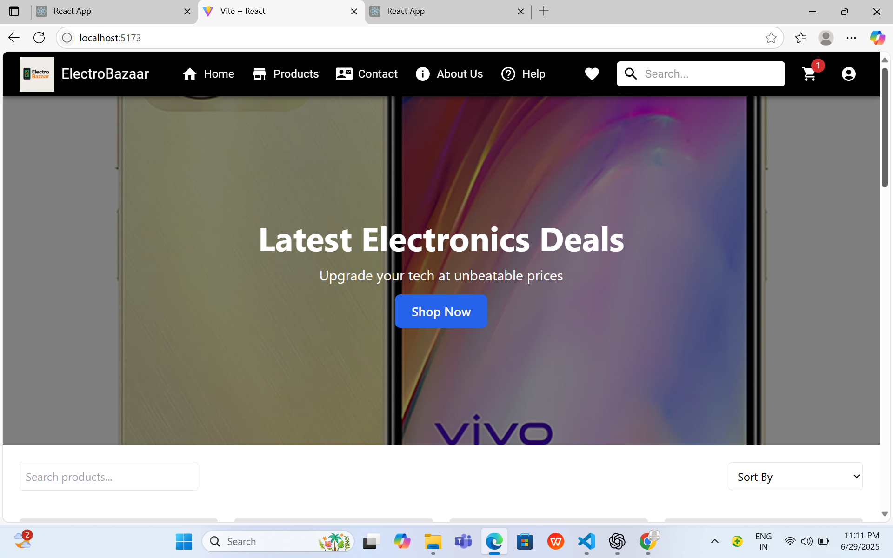
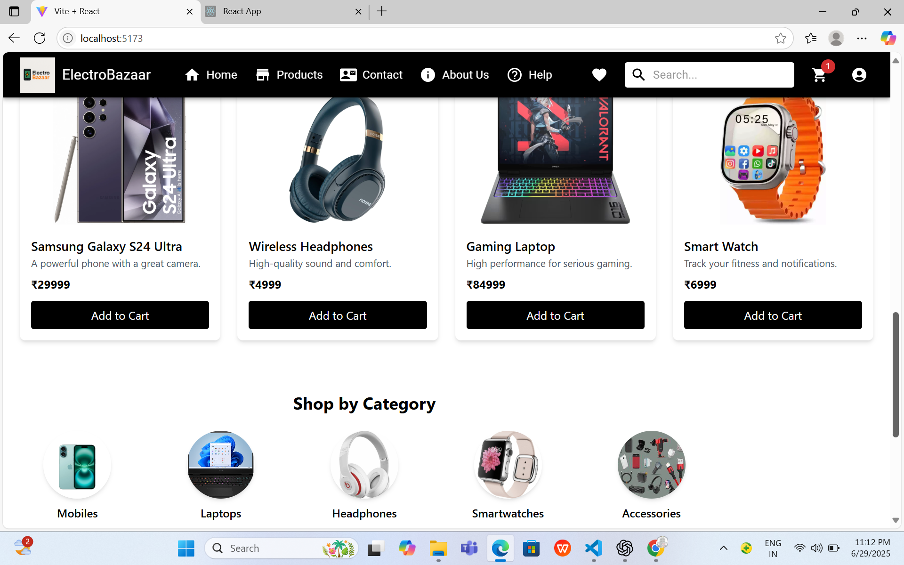
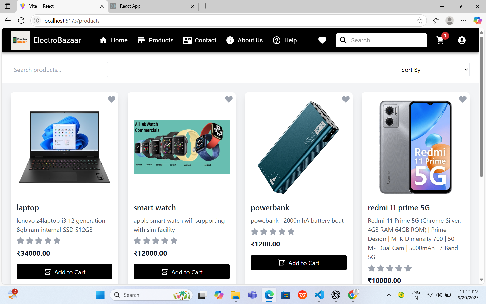
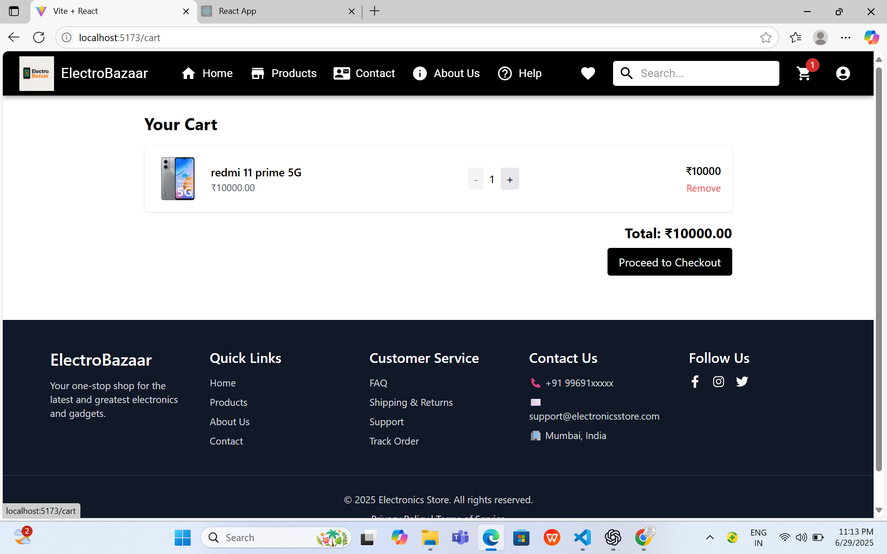
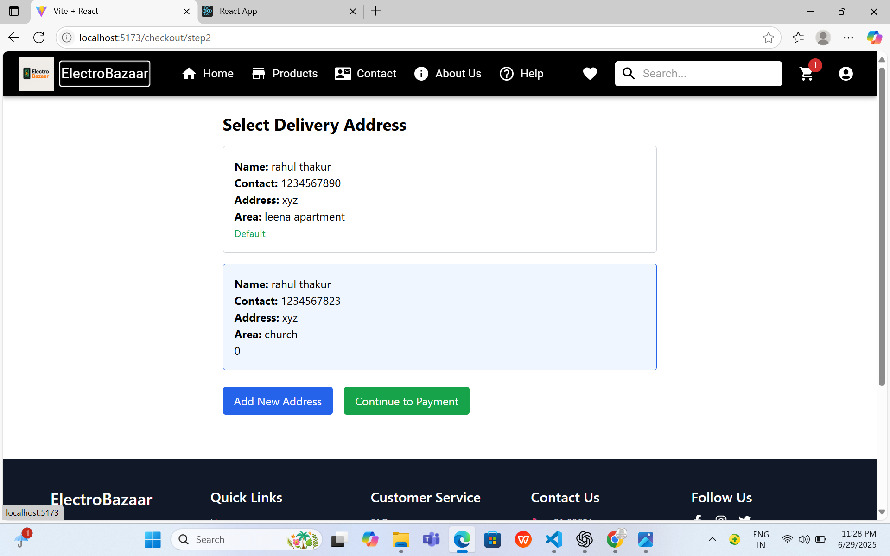
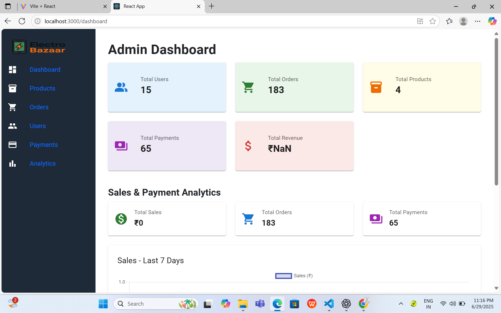
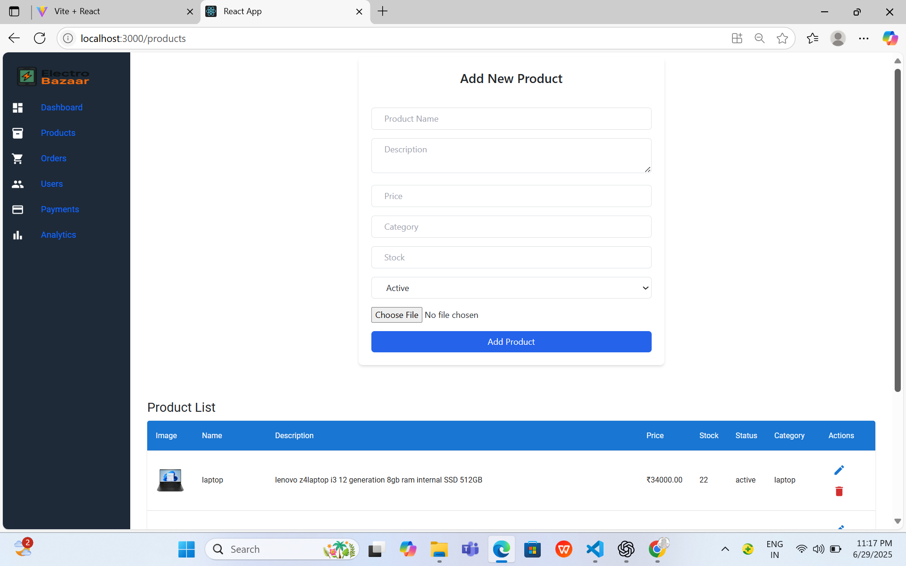
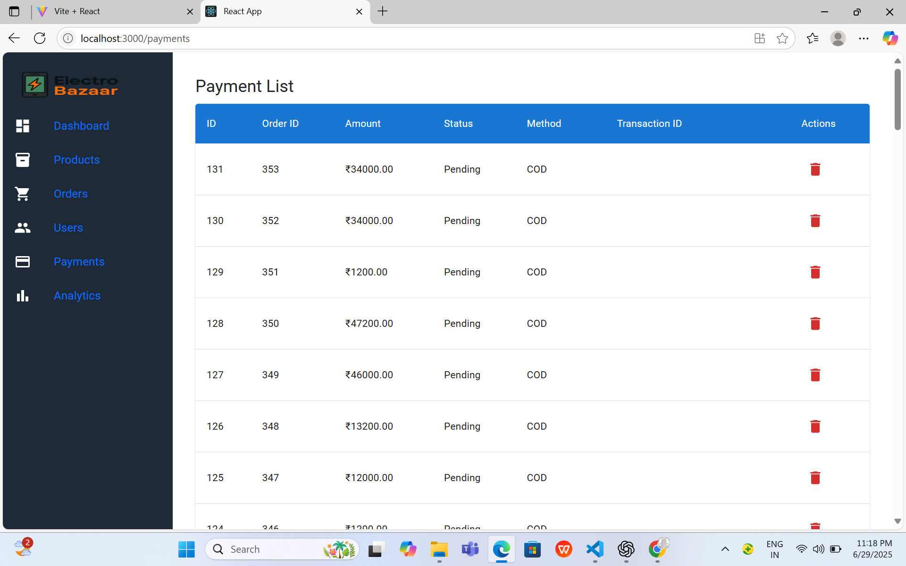

# ⚡ ElectroBazaar – Electronic Website (Fullstack eCommerce Project)

A fully functional eCommerce website with admin panel, payment integration, and product management. Designed for scalability and real-time order flow.

---

## 🚀 Tech Stack

- 🛍️ **Frontend (User):** React + Vite
- 🛒 **Admin Panel:** React + Tailwind CSS
- 🔧 **Backend:** Node.js + Express
- 💾 **Database:** MySQL
- 💳 **Payments:** Razorpay Integration
- 📊 **Analytics:** Chart.js + Custom APIs

---

## 📁 Folder Structure

electrobazaar_electronic_website/
├── Electrobazaar_frontend/ # Customer-facing website
├── Electrobazaar_admin-panel/ # Admin panel for product & order management
├── Electrobazaar-backend/ # Node.js + MySQL backend API
├── screenshots/ # Screenshots for UI previews
└── README.md

---

## 🔑 Features

### ✅ User Website (Frontend)
- Product listing with filters
- Add to cart / wishlist
- Product rating system
- Razorpay payment integration
- Order tracking

### ✅ Admin Panel
- Dashboard analytics (orders, revenue)
- Add / Edit / Delete products
- Manage orders (status update)
- Search orders by product name
- User management

### ✅ Backend API
- RESTful APIs using Express.js
- JWT-based Authentication
- MySQL relational database
- Secure routes
- Admin-user separation

---

## 📸 Screenshots

### 🏠 Home Page - Banner View  

### 🏠 Home Page - Product View  

### 📦 Product Listing  

### 🛒 Cart Page  

### 📬 Address Entry Page  

---

### 🔐 Admin Panel

### 📊 Dashboard Overview  

### 🧩 Product Management  

### 💳 Payment Management  

---

## 🧑‍💻 Author

**👨‍💻 Rahul Thakur**  
🔗 GitHub: [RahulThakur44](https://github.com/RahulThakur44)

---

## 📌 Deployment (Optional)

You can deploy this project using:

- Frontend: [Netlify](https://electrobazaar-frontend.netlify.app/)
- Backend: [Render](https://electrobazaar-backend-5.onrender.com)
- MySQL:  [Railway](https://railway.app/)

---

## 📎 License

This project is open-source and available under the MIT License.
